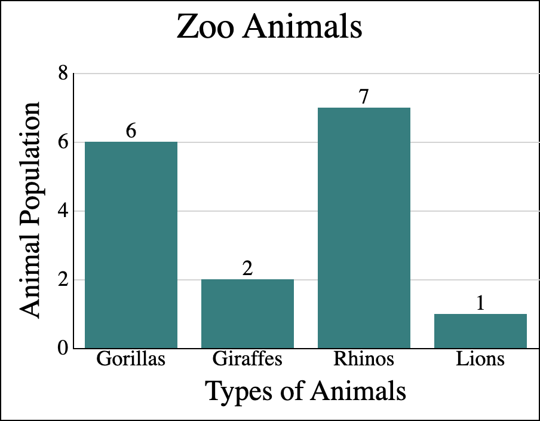
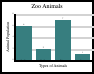
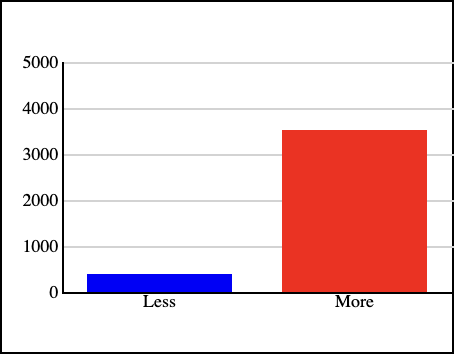
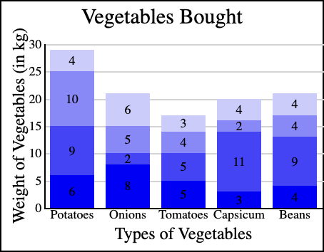

# ABOUT

This function uses jquery to render data as a bar chart in html!

# SAMPLES

Large!



---

Small!



---

Simple!



---

Complex!



# API

## Function call

`drawBarChart(data, options, element)`

---

### Data

An array of objects in the following format:

```
  [{
    value: [1, 2, 3, ...],
    barColor: ["blue", "red", "green", ...],
    barLabel: "Lorem",
  }]
```

Where each object is represented as a single bar on the rendered chart.

- Each element in the `value` array is rendered as a sub-bar stacked bottom to top within the same bar
- Arrays consisiting of a single element are rendered as a single solid bar (not stacked)
- Each `value` element is rendered in a color at the corresponding index of the `barColor` array
- Colors can be designated by a string formatted as color name, RGB, HEX or HSL
- The bar is labelled on the x-axis by the string value of `barLabel`
- The label can made blank either by passing an empty string or by omitting the key value pair.

---

### Options

An object formatted so:

```
  {
    width: 450,
    height: 350,
    title: "Zoo Animals",
    titleSize: 30,
    titleColor: "black",
    barDataPosition: "above",
    barDataLabelColor: "black",
    barSpacing: 20,
    xLabel: "Types of Animals",
    yLabel: "Animal Population",
    maxScale: null,
  }
```

WIDTH: an `integer` determining, in pixels, the total width of the rendered chart element

HEIGHT: an `integer` determining, in pixels, the total height of the rendered chart element

TITLE: an optional `string` that is rendered at the top of the chart element. Omitting this renders a chart with no title.

TITLE SIZE: an `integer` determining, in pixels, the font size of the title element. From this value the size of the margins along with the font sizes of both X and Y axis labels, bar labels and data values are calculated. This simplification enhances scalability of the rendered chart

TITLE COLOR: an optional `string` determining the font color of the title element. This can be formatted as color name, RGB, HEX or HSL. Defaults to black.

BAR DATA POSITION: an optional `string` determining the position of the data value label relative to the parent bar or sub-bar. If omitted, no data value labels are rendered. Accepted values are:

- `above`: data value sits just on top of the bar. For clarity, this is not recommended with stacked bar charts.
- `top`: data value sits within the bar or sub-bar, at the top
- `middle`: data value sits wthin the bar or sub-bar, centered vertically
- `bottom`: data value sits within the bar or sub-bar, at the bottom.

BAR DATA LABEL COLOR: an optional `string` determining the font color of the data label element. This can be formatted as color name, RGB, HEX or HSL. Defaults to black.

BAR SPACING: an `integer` determining the spacing, in pixels, between each bar. Half this value is added before the first bar and after the last for visual clarity and balance. Bar width is determined dynamically based on the number of data inputs and the length of the x-axis

X LABEL: an optional `string` that is rendered beneath the x-axis element.

Y LABEL: an optional `string` that is rendered vertically to the left of the y-axis element.

MAX SCALE: an optional `integer` that sets a value as the upper limit of the y-axis scale. By default this number, along with the scale increment, is determined dynamically based on the sum value of the largest bar. It is recommended that this key value pair be omitted or left null, as visual balance and irrational increments can result. It can be used to massage the impact of a chart though, such as by making the bars look small relative to the scale, or making a bar go literally off-the-chart.

---

### Element

A JQuery element to which the chart will be appended.

```
$(selector)
```

For more detailed instructions on using Jquery selectors, look [here](https://api.jquery.com/category/selectors/).

# Known issues

- Bar value labels are rendered even if the associated bar (or sub-bar) aren't large enough to contain them neatly.
- Scale numbers with more than 2 digits overlap with the Y-axis label.

# In Development

- A color coordinated legend that will indicate the significance of sub-bars.
- WAI-ARIA compliance

# Acknowlegements

As always, this wouldn't have been built without [Stack Overflow](https://stackoverflow.com/) holding my hand.
